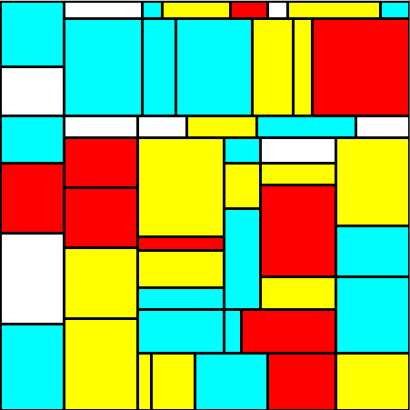
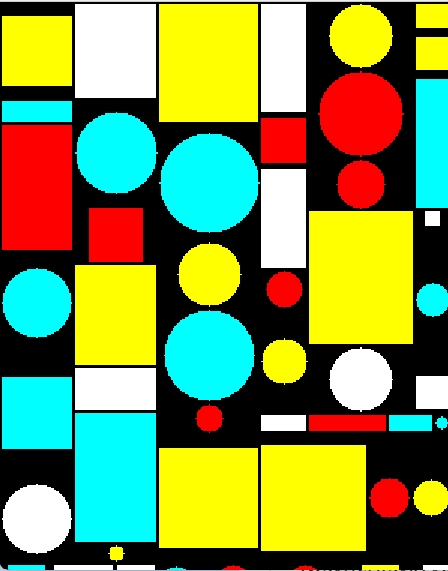

# Mondrian Art Generator

This Java project generates abstract artwork inspired by Piet Mondrian’s iconic style. Users can create either basic or complex Mondrian-style images with primary colors and black borders.

## Features

- **Basic Mondrian Art:** Recursively splits the canvas into rectangles and fills them with random primary colors (red, yellow, cyan) or white, bordered in black.
- **Complex Mondrian Art:** Introduces additional shapes such as squares and circles for more varied and intricate compositions.
- **Customizable Canvas:** Users can specify image width and height (minimum 300px) at runtime.
- **Pixel-level Manipulation:** Uses a `Picture` class for direct manipulation of individual pixels.
- **Image Output:** Generated artwork is saved as PNG files (`basic.png` or `extension.png`) and displayed in a GUI window.

## Classes

- **`Mondrian`** – Implements the painting algorithms for basic and complex Mondrian-style art.
- **`Picture`** – Provides utilities for pixel-level image manipulation, saving images, and displaying them on-screen.
- **`Client`** – Command-line interface for selecting the type of artwork and specifying canvas dimensions.

## Example Output

| Basic Mondrian | Complex Mondrian |
|---|---|
|  |  |

## Usage

1. Compile all Java files:
   ```bash
   javac *.java
2. Run the client program:
   ``` bash
   javac Client
3. Follow prompts to choose art type and specify canvas dimensions.
4. The generated image will be saved as `basic.png` (for basic art) or `extension.png` (for complex art) and displayed in a GUI window.

## Requirements

- Java 8 or higher
